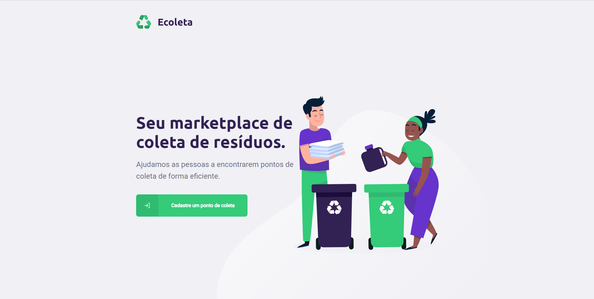
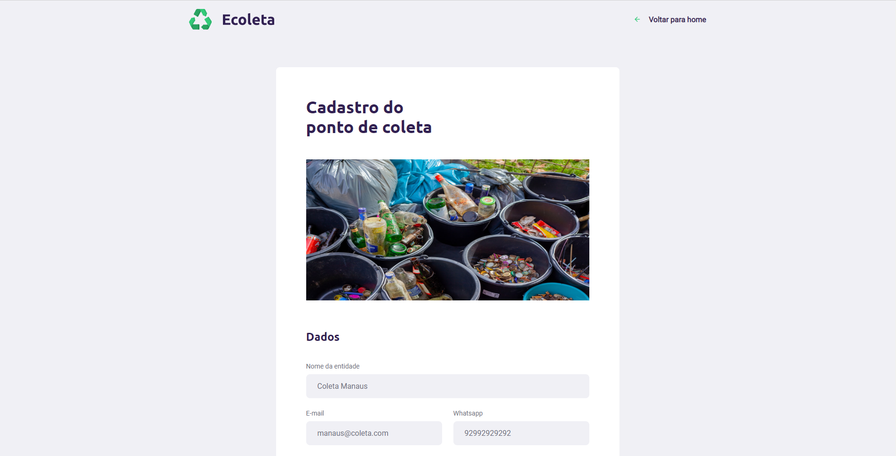
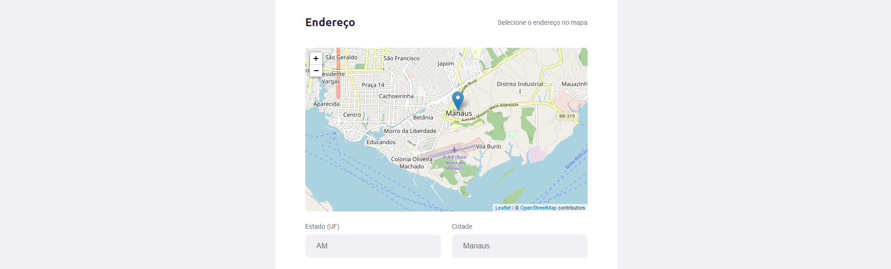
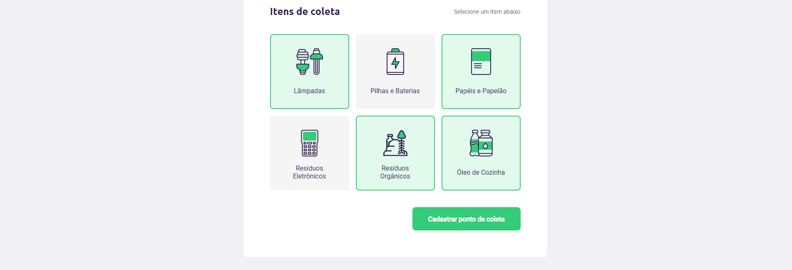
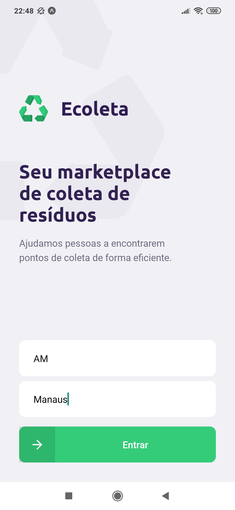
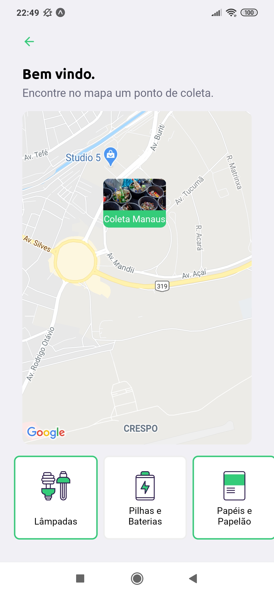
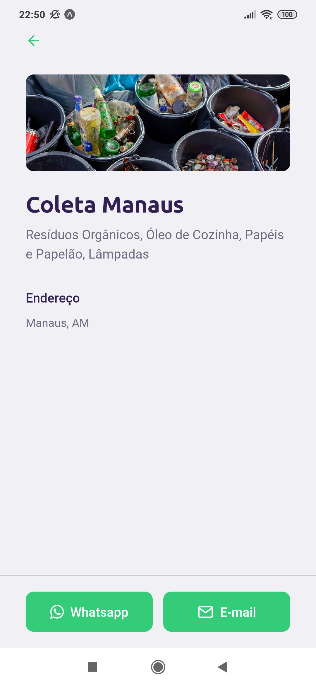

<h1 align="center">
    
</h1>
<div align="center">


<a href="https://rocketseat.com.br">
    
</a>

</div>

## Sobre

Ecoleta é um projeto desenvolvido na Next Level Week 1 da Rocketseat. Com o objetivo de ajudar as pessoas a encontrarem pontos de coleta de forma eficiente.

## Demo web

Cadastrando um ponto de coleta.





## Demo mobile

Visualizando o ponto de coleta cadastrado.

<p align="center">
  

  

  
</p>

## Como executar o projeto

### Pré-requisitos:

Ter instalado o [Git](https://git-scm.com/downloads) e [Nodejs](https://nodejs.org/en/download/).

```bash
# Fazer download do projeto.
$ git clone https://github.com/MayconEduardo/ecoleta.git

# Entrar na pasta ecoleta
$ cd ecoleta
```

#### Executando o Back End (server)
```bash
# Entrar na pasta server
$ cd server

# Instalar as dependências
$ npm install

# Criar banco de dados e suas tabelas
$ npm run knex:migrate

# Povoar o banco de dados
$ npm run knex:seed

# Executar o projeto
$ npm run dev
```

### Executando o Front End (web)
```bash
# Entrar na pasta web
$ cd web

# Instalar as dependências
$ npm install

# Executar o projeto
$ npm start
```
> Se o browser não abrir automaticamente, acesse: http://localhost:3000.

### Executando o Mobile (mobile)
```bash
# Entrar na pasta mobile
$ cd mobile

# Instalar as dependências
$ npm install

# Executar o projeto
$ npm start
```
> Para usar a aplicação no seu Smartphone instale o Expo pela [Google Play](https://play.google.com/store/apps/details?id=host.exp.exponent) ou [App Store](https://apps.apple.com/app/apple-store/id982107779).

## Tecnologias

#### **Server** ([Nodejs][node] + [TypeScript][typescript])

  - **[Express][express]**
  - **[CORS][cors]**
  - **[KnexJS][knex]**
  - **[SQLite][sqlite3]**
  - **[Multer][multer]**
  - **[Celebrate][celebrate]**
  - **[Joi][joi]**

#### **Web** ([React][react] + [TypeScript][typescript])

  - **[React Router Dom][react_router_dom]**
  - **[React Icons][react_icons]**
  - **[Axios][axios]**
  - **[Leaflet][leaflet]**
  - **[React Leaflet][react_leaflet]**
  - **[React Dropzone][react_dropzone]**

#### **Mobile** ([React Native][react_native] + [TypeScript][typescript])

  - **[Expo][expo]**
  - **[Expo Google Fonts][expo_google_fonts]**
  - **[React Navigation][react_navigation]**
  - **[React Native Maps][react_native_maps]**
  - **[Expo Constants][expo_constants]**
  - **[React Native SVG][react_native_svg]**
  - **[Axios][axios]**
  - **[Expo Location][expo_location]**
  - **[Expo Mail Composer][expo_mail_composer]**

  #### **Utilitários**
- API: **[IBGE API][ibge_api]** &rarr; **[API de UFs][ibge_api_ufs]**, **[API de Municípios][ibge_api_municipios]** 
- Teste de API: **[Insomnia][insomnia]**
- Ícones: **[Feather Icons][feather_icons]**, **[Font Awesome][font_awesome]**
- Fontes: **[Ubuntu][font_ubuntu]**, **[Roboto][font_roboto]**

## Licença

Esse repositório está licenciado pela **MIT LICENSE**.

<!-- Techs -->

[react]: https://reactjs.org/

[typescript]: https://www.typescriptlang.org/

[node]: https://nodejs.org/en/

[leaflet]: https://react-leaflet.js.org/en/

[ibge_api]: https://servicodados.ibge.gov.br/api/docs/localidades?versao=1

[ibge_api_ufs]: https://servicodados.ibge.gov.br/api/docs/localidades?versao=1#api-UFs-estadosGet

[ibge_api_municipios]: https://servicodados.ibge.gov.br/api/docs/localidades?versao=1#api-Municipios-estadosUFMunicipiosGet

[react_native]: http://www.reactnative.com/

[express]: https://expressjs.com/

[cors]: https://expressjs.com/en/resources/middleware/cors.html

[knex]: http://knexjs.org/

[sqlite3]: https://github.com/mapbox/node-sqlite3

[feather_icons]: https://feathericons.com/

[insomnia]: https://insomnia.rest/

[react_leaflet]: https://react-leaflet.js.org/

[react_router_dom]: https://github.com/ReactTraining/react-router/tree/master/packages/react-router-dom

[react_icons]: https://react-icons.github.io/react-icons/

[axios]: https://github.com/axios/axios

[expo]: https://expo.io/

[expo_google_fonts]: https://github.com/expo/google-fonts

[react_navigation]: https://reactnavigation.org/

[react_native_maps]: https://github.com/react-native-community/react-native-maps

[expo_constants]: https://docs.expo.io/versions/latest/sdk/constants/

[react_native_svg]: https://github.com/react-native-community/react-native-svg

[expo_location]: https://docs.expo.io/versions/latest/sdk/location/

[expo_mail_composer]: https://docs.expo.io/versions/latest/sdk/mail-composer/

[font_roboto]: https://fonts.google.com/specimen/Roboto

[font_ubuntu]: https://fonts.google.com/specimen/Ubuntu

[font_awesome]: https://fontawesome.com/

[multer]: https://github.com/expressjs/multer

[celebrate]: https://github.com/arb/celebrate

[joi]: https://github.com/hapijs/joi

[react_dropzone]: https://github.com/react-dropzone/react-dropzone